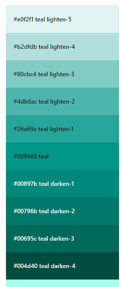
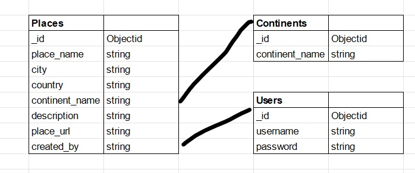

<h1 align="center">PlaceToGo (ms3)</h1>

<span id="placetogo"></span>

<h2 align="center"></h2>

PlaceToGo is a site that allows users to find places to go to. Users can also make their own account to be able to create, share, edit and delete their own posts about places they've been and recommend.

This project is my third assignment of the Full stack development course I am following at CodeInstitute to show my skills with HTML, CSS, JavaScript, Python, Flask and MongoDB.

[View the live project here.](https://place-to-go-project.herokuapp.com/)

---

## Index 

- <a href="#ux">1. User experience (UX)</a>
  - <a href="#ux-goals">1.1. Project goals</a>
  - <a href="#ux-stories">1.2 User stories</a>
  - <a href="#ux-design">1.3 Design</a>
  - <a href="#ux-architecture">1.4 Information architecture</a>
  - <a href="#ux-mockup">1.5 Mockup designs</a>
- <a href="#features">2. Features</a>
  - <a href="#features-existing">2.1 Existing features</a>
  - <a href="#features-future">2.2 Features left to implement in the future</a>
- <a href="#technologies">3. Technologies used</a>
- <a href="#testing">4. Testing</a>
- <a href="#deployment">5. Deployment</a>
- <a href="#credits">6. Credits</a>
- <a href="#Acknowledge">7. Acknowledge</a>
- <a href="#Acknowledge">8. Disclaimer</a>

---

<span id="ux"></span>

<h1>1. User experience (UX)</h1>

<span id="ux-goals"></span>

### 1.1 Project goals 

- Making a full-stack site that allows users to manage a common dataset about a particular domain. 
- Making a full-stack site that uses HTML, CSS, JavaScript, Python+Flask and MongoDB.

- Creating a website that serves as a platform where people can get inspired for places to go in the future and to share their own experiences and places.
- Creating a website that is simple to understand and easy to navigate.
- The users of the website can make use of CRUD (create, read, update and delete) for the recipes. 

<span id="ux-stories"></span>

### 1.2 User stories 

**First Time Visitor Goals**

1. As a First Time Visitor, I want to easily navigate throughout the website.
2. As a First Time Visitor, I want to visit the site on every kind of device, so on a desktop, tablet and mobile phone.
3. As a First Time Visitor, I want to have an overview of all the places/posts, so I can find a place(s) I like.
4. As a First Time Visitor, I want to register an account, so I can add and share my own places.
5. As a First Time Visitor, I want to search for specific places based on words, so I can easily find places.

**Site member goals**

All the goals of first-time visitors also apply for site members. There are additional user stories to the site members because they have more access to the website. See the additional user stories below. 
1. As a site member, I want to add my places, so I can share my places. 
2. As a site member, I want to edit my places, so I can update information in the place.
3. As a site member, I want to delete my places, so I can remove the place when it is no longer relevant. 
4. As a site member, I want to login to my profile, so I have access to my places. 
5. As a site member, I want to logout of my profile.

**Admin goals**

1. As an admin, I want to see all places.
	
<span id="ux-design"></span>

### 1.3 Design 
    
- #### Colour Scheme
The colours used for the website are various shades of teal provided by [Materialize](https://materializecss.com/color.html).


- **#e0f2f1 teal lighten-5** is used for the background of the whole website.
- **#b2dfdb teal lighten-4** is used for the background of the card-panel on the profile page.
- **#009688 teal** is used for the navbar and footer.
- **#00695c teal darken-3** is used to announce the user on the profile page.
- **#004d40 teal darken-4** is used for the flash messages text, the buttons and the page h3's.

- #### Fonts
The **Itim font** is used throughout the whole website for all text. sans serif is the fallback in case the main font isn't being imported to the site correctly. I used this font because it's easy to look at.

- #### Icons
In this project the icons used are provided by [materialize](https://materializecss.com/icons.html). The icons used have a helpful and functional purpose for example the double arrow for the menu. The also give character to for example; the input fields.

- #### Images
The images I used for this project came from several places: 
- default image for place: [Pexels](https://www.pexels.com/) uploaded by: [Element5 digital](https://www.pexels.com/nl-nl/@element5). 
- Anne frank house: [amsterdam](http://www.amsterdam.nu/wp-content/uploads/2014/10/anne-frank.jpg)
- Moomin cafe: [tripadvisor](https://media-cdn.tripadvisor.com/media/photo-s/13/74/f2/0a/photo0jpg.jpg)
- Amsterdam Lookout: [architectenweb](https://architectenweb.nl/media/illustrations/2017/03/14db40d3-9444-4b6c-ad26-aafc7e7d763b_400.jpg)

- #### Defensive design 

    - The user is not able to break the site by clicking on buttons. 
    - The signup form: 
        - The username has to be between 5-20 characters and must only contain letters and numbers. 
        - The password has to be between 5-20 characters and must contain at least one number, and one uppercase and lowercase letter.
    - The add and edit place form:
     - The place name has to be between 3-30 characters and must only contain letters and numbers.
     - The city has to be between 3-30 characters and must only contain letters.
     - The country has to be between 3-30 characters and must only contain letters.
        - The image URL must start with http:// or https://.
    - A place can't be deleted by just one click. If someone clicks on the delete button, there wil be a pop up with a confirmation if someone is sure to delete the place.

- #### Interactive design 

    - The website has to be easy to navigate. 
    - The user can quickly find the information he/she wants to find. 

<span id="ux-architecture"></span>

### 1.4 Information architecture
The project has three collections in the database. The database structure in MongoDB is as follows:


<span id="ux-mockup"></span>

### 1.5 Mockup designs
See all Wireframes [here](wireframes/ms3.pdf)

The wireframes were made with [Balsamiq](https://balsamiq.com/)

<span id="features"></span>

<h1>2. Features</h1>

### 2.1 Existing features 

#### 1. Design 
- An attractive and simple layout with consistency.
- Simple navigation throughout the website by using the navigation bar. 
- Showing the places simple and clearly

#### 2. General 
- The home page shows an introduction in the shape of a header and introduction text. And the page shows a couple of new recipes. 
- There are links to the social media platforms at the top and bottom of the website. 
- People can sign up for the newsletter. 

#### 3. Places
- Places can be created, read, updated and deleted (CRUD) by the users. 
- People can search for places with the search bar. 
- Users have access to their profile, with an overview of all their places. 
- Places include the name, city, country, continent and a description/review.

#### 4. Signup, signin and signout 
- People can create a new account on the web application. 
- People can signin with their existing accounts. 
- People can easily sign out.
- If a person creates a new account, signs in or signs out, a flashed message will appear with the action the person has done.

<span id="features-future"></span>

### 2.2 Features left to implement in the future 
- Giving the users the option to upload an image from their own library which will be stored in cloudinary.
- Allowing users to save certain places from other uses which will show up on their profile.
- Add form validation on the backend.
- Allowing users to edit and delete their profile.

<span id="technologies"></span>

<h1>3. Technologies used</h1>

### Languages Used

-   [HTML5](https://en.wikipedia.org/wiki/HTML5)
-   [CSS3](https://en.wikipedia.org/wiki/Cascading_Style_Sheets)
-   [JavaScript](https://nl.wikipedia.org/wiki/JavaScript)
-   [Python](https://en.wikipedia.org/wiki/Python_(programming_language) 

#### Frameworks, libraries & Other
- [Gitpod](https://www.gitpod.io/) 
    - The GitPod is used to develop the project.
- [Git](https://git-scm.com/)
    - The Git was used for version control to commit to Git and push to GitHub.
- [GitHub](https://github.com/)
    - The GitHub is used to host the project.
- [jQuery:](https://jquery.com/)
    - jQuery came with Bootstrap to make the navbar responsive but was also used for the smooth scroll function in JavaScript.
- [Google Fonts](https://fonts.google.com/)
    - Google Fonts is used to provide the font Itim for all the text that is used in the project. 
- [Balsamiq:](https://balsamiq.com/)
    - Balsamiq was used to create the [wireframes](https://github.com/) during the design process.
- [Materialize](https://materializecss.com/)
    - Materialize is used for the design framework.
- [MongoDB](https://www.mongodb.com/1)
    - MongoDB is the fully managed cloud database service used for the project.
- [Heroku](https://dashboard.heroku.com/)
    - Heroku is the cloud platform to deploying the app.
- [Flask](https://flask.palletsprojects.com/en/1.1.x/)
    - Flask is the web framework used to provide libraries, tools and technologies for the app.
- [Jinja](https://jinja.palletsprojects.com/en/2.11.x/)
    - Jinja is used for templating Python
- [Werkzeug](https://werkzeug.palletsprojects.com/en/1.0.x/)
    - Werkzeug is used for password hashing and authentication and autohorization.

#### Testing tools used 
- [Chrome DevTools](https://developers.google.com/web/tools/chrome-devtools/open) is used to detect problems and test responsiveness.
- [Autoprefixer](https://autoprefixer.github.io/)
    - Autoprefixer is used to parse the CSS and to add vendor prefixes to CSS rules. 
- [W3C Markup Validation Service](https://validator.w3.org/)
    - The W3C Markup Validation Service is used to check whether there were any errors in the HTML5 code. 
- [W3C CSS validator](https://jigsaw.w3.org/css-validator/)
    - The W3C CSS validator is used to check whether there were any errors in the CSS3 code.
- [JShint](https://jshint.com/)
    - JShint is a JavaScript validator that is used to check whether there were any errors in the JavaScript code. 
- [PEP8](http://pep8online.com/)
    - The PEP8 validator is used to check whether there were any errors in the Python code.

<span id="testing"></span>

<h1>4. Testing</h1>

The testing process can be found [here](TESTING.md).

<span id="deployment"></span>

<h1>5. Deployment</h1>

#### Requirements 
- Python3 
- Github account 
- MongoDB account 
- Heroku account

#### Clone the project 
To make a local clone, follow the following steps. 
1. Log in to GitHub and go to the repository. 
2. Click on the green button with the text **“Code”.**
3. Click on **“Open with GitHub Desktop”** and follow the prompts in the GitHub Desktop Application or follow the instructions from **[this link](https://docs.github.com/en/free-pro-team@latest/github/creating-cloning-and-archiving-repositories/cloning-a-repository#cloning-a-repository-to-github-desktop)** to see how to clone the repository in other ways. 

#### Working with the local copy
1. Install all the requirements: Go to the workspace of your local copy. In the terminal window of your IDE type: **pip3 install -r requirements.txt**.
2. Create a database in MongoDB  
    - Signup or login to your MongoDB account.
    - Create a cluster and a database.
    - Create four collections in the db: **categories, recipes, subscribers, users.**
    - Add string values for the collections. See <a href="#ux-architecture">my Information architecture</a> how the database is set up for this project.
3. Create the environment variables 
    - Create a .gitignore file in the root directory of the project.
    - Add the env.py file in the .gitignore.
    - Create the file env.py. This  will contain all the envornment variables.
    ```
    Import os
    os.environ.setdefault("IP", "Added by developer")
    os.environ.setdefault("PORT", "Added by developer")
    os.environ.setdefault("SECRET_KEY", "Added by developer")
    os.environ.setdefault("MONGO_URI", "Added by developer")
    os.environ.setdefault("MONGO_DBNAME", "Added by developer")
    ```
4. Run the app: Open your terminal window in your IDE. Type python3 app.py and run the app.

#### Heroku Deployment  
1. Set up local workspace for Heroku 
    - In terminal window of your IDE type: **pip3 freeze -- local > requirements.txt.** (The file is needed for Heroku to know which filed to install.)
    - In termial window of your IDE type: **python app.py > Procfile** (The file is needed for Heroku to know which file is needed as entry point.)
2. Set up Heroku: create a Heroku account and create a new app and select your region. 
3. Deployment method 'Github'
    - Click on the **Connect to GitHub** section in the deploy tab in Heroku. 
        - Search your repository to connect with it.
        - When your repository appears click on **connect** to connect your repository with the Heroku. 
    - Go to the settings app in Heroku and go to **Config Vars**. Click on **Reveal Config Vars**.
        - Enter the variables contained in your env.py file. it is about: **IP, PORT, SECRET_KEY, MONGO_URI, MONGO_DBNAME**
4. Push the requirements.txt and Procfile to repository. 
     ```
    $ git add requirements.txt
    $ git commit -m "Add requirements.txt"

    $ git add Procfile 
    $ git commit -m "Add Procfile"
    ```
5. Automatic deployment: Go to the deploy tab in Heroku and scroll down to **Aotmatic deployments**. Click on **Enable Automatic Deploys**. By **Manual deploy** click on **Deploy Branch**.

Heroku will receive the code from Github and host the app using the required packages. 
Click on **Open app** in the right corner of your Heroku account. The app wil open and the live link is available from the address bar. 

<span id="credits"></span>

<h1>6. Credits</h1>

#### Code
- [Codeinstitute](https://codeinstitute.net/): For teaching me the basics and making it possible to do this project especially the task manager mini project was helpful to this project.
- [BREAKTASTY](https://ms3-breaktasty.herokuapp.com/): A whole bunch of little snippets were used from this project to compare and add to my own code, also to help me put together the README file.
- [Materialize](https://materializecss.com/): Most of the designing was done with materialize.

<span id="Acknowledge"></span>

<h1>7. Acknowledge</h1>

- The support and guidance of my mentor Precious Ijege. 
- The lessons and knowledge of [Code Institute.](https://codeinstitute.net/)
- The mental support of my friends and family.

<span id="Disclaimer"></span>

<h1>8. Disclaimer</h1>
This project is for educational purposes only. If there is an issue with the copyright or the content, please contact me: lonneke1908@gmail.com

Thanks for visiting

<a href="#placetogo">Back to top!</a>