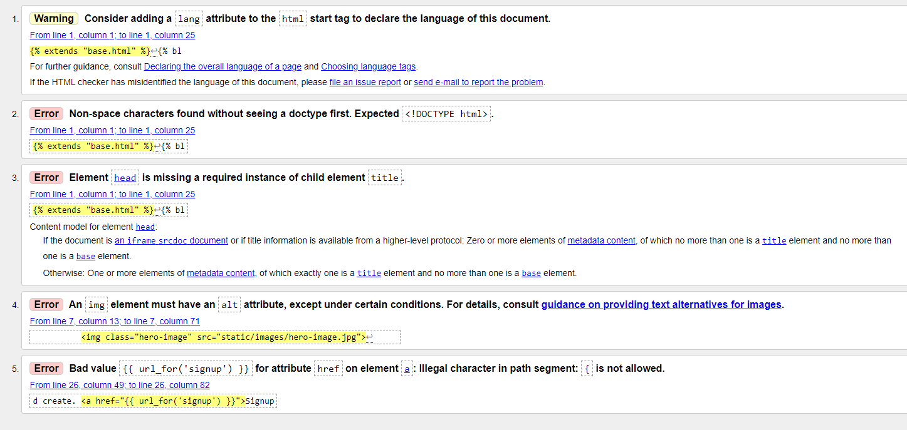
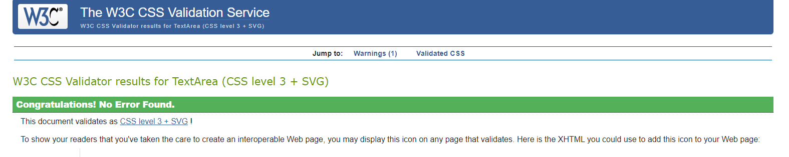
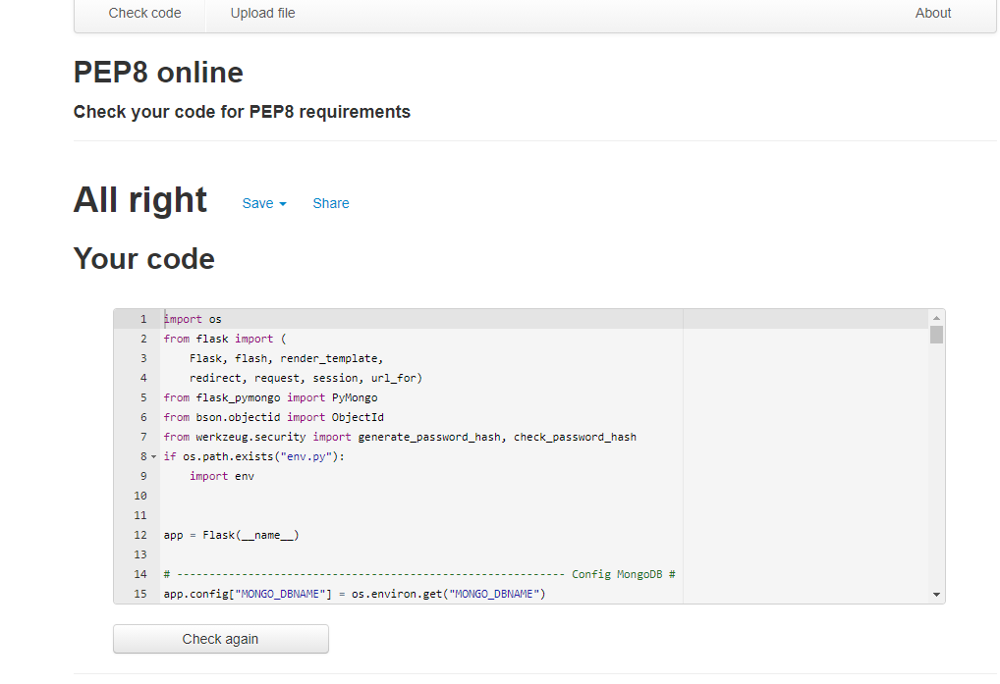
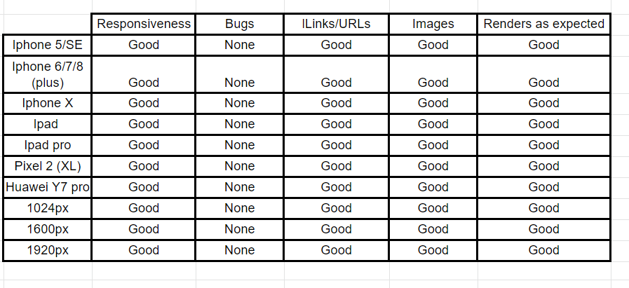
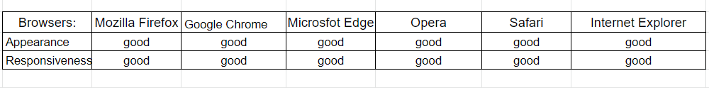

<h1 align="center">Testing</h1>

---

## Index 

- <a href="#validators">1. Code validators</a>
- <a href="#responsiveness">2. Responsiveness</a>
- <a href="#browser-compatibility">3. Browser compability</a>
- <a href="#user-stories">4. Testing user stories </a>
- <a href="#defensive-design">5. Defensive design</a>
- <a href="#bugs">5. Bugs</a>

---

<span id="validators"></span>

## 1. Code validators
 - **[HTML Validator](https://validator.w3.org/):** No errors to show.
    - With testing the HTML code, I had some syntax issues on all pages I build with jinja templating.



- **[CSS Validator](https://jigsaw.w3.org/css-validator/):** No errors found.


- **[JS Hint](https://jshint.com/):** No errors found, one undefined variable 
    - 1 undefined variable: $

- **[Python validator | PEP8](http://pep8online.com/):** No errors found



---

<span id="responsiveness"></span>

## 2. Responsiveness 
- Responsiveness of the site is tested with [Chrome DevTools](https://developers.google.com/web/tools/chrome-devtools) and [Responsive Design Checker](https://www.responsivedesignchecker.com/).
- The site is tested on the following devices: 
    - Desktop: 1024px, 1600px and 1920px. 
    - Mobile & Tablet: Galaxy S5, iPhone 5/SE, iPhone 6/7/8, iPhone 6/7/8 plus, iPhone x, iPad and  iPad Pro.



---

<span id="browser-compatibility"></span>

## 3. Browser compatibility


--- 

<span id="user-stories"></span>

## 4. Testing user stories 

### First-time visitor goals:
1. As a first time visitor, I want to be able to visit the website on every device, so that I can look at the website on desktop, mobile and tablet. 
    - The first time visitor can visite the website on a computer, laptop, tablet and phone.
2. As a first time visitor, I want to be able to navigate easily through the website, so I can find everything easily. 
    - The first time visitor can navigate through the website with the navbar. The navbar is on top of the website. For the mobile visitors there is a mobile menu.
3. As a first time visitor, I want to see an overview of all places, so I can get inspired by all places.
    - The first time visitor can visit an overview of all places by clicking on home. On this page there is an overview of all places made. 
4. As a first time visitor, I want to be able to search places based on words, so I can find places easily.
    - On the home page there is a searchbar, where first time visitors can search for words. The search is based on all input fields except for the image url. 
5. As a first time visitor, I want to register an account on the website, so I can share my own places. 
    - The first time visitor can navigate to the signup page by clicking on SignIn/Up at the right in the navbar. If the first time visitor clicks on the SignIn/Up link they have a choice to sign in or sign up. If the first time visistor clicks on sign up, they will navigate to the sign up form on the website. 

### Site member goals
1. As a site member, I want to add my own place, so I can share my places.
    - A site member can add places by clicking on 'Add Place' in the navbar or to click on the link: add new place + on the profile (only for desktop) page. Both ways lead to the add place form where site members can add a new place. 
2. As a site member, I want to edit my recipes, so I can update information in the recipe.
    - A site member has a profile page. On the profile page, there is an overview of all places made by the site member. By each place there is an edit button. If the site member clicks on the edit button they will navigate to the edit place form, where they can edit there place.
3. As a site member, I want to delete my places, so I can remove the place when it is no longer relevant. 
    - A site member can delete a place on the profile page, the home page and specific place page. There is an overview of all recipes made by the site member on the profile page. There is a button by each place, to delete the place. 
4. As a site member, I want to sign in to my profile, so I have access to my places. 
    - A site member can sign in by clicking on Sign In/Up at the navbar on the website. 
5. As a site member, I want to sign out to my profile.
    - As a site member is signed in they can logout by clicking on Sign Out link in the navbar.

### Admin goals
1. As an admin, I want to see all places.
    - The admin can see all places on the profile page.
---
<span id="defensive-design"></span>

## 5. Defensive design 

1. The user is not able to break the site by clicking on buttons. 

**Answer 1:** All buttons on the website work. The buttons on the website consist buttons that lead to other pages or submit buttons to add, edit or delete something from the database.

2. The sign up form: 
    - 2.1 The username has to be between 5-20 characters and only must contain letters and numbers.
    - 2.2 The password has to be between 5-20 characters and must contain at least one number, and one uppercase and lowercase letter.
        
3. The add and edit recipe form:
    - 3.1 The place name has to be between 3-30 characters and must only contain letters and numbers.
    - 3.2 The city has to be between 3-30 characters and must only contain letters.
    - 3.3 The country has to be between 3-30 characters and must only contain letters.
        - The validation for the place name, city and country is done with front end validation and by using patterns
    - 3.4 The image URL must start with http:// or https://.

**Answer 2 + 3 + 4:** 
The validation of all input fields is done with front end validation and by using the validate functionality from materialize. 

- The input fields between a number  of characters. This is done minlength, maxlength and the pattern attribute. 
- The input fields have a number of criteria. These criterias where set by the pattern attribute.
- The html type attribute is used to set for example text or url.
- The required functionality is used to make the input fields required. 

See below the input fields for front end validation
    
    ```
    Signup: 
    <input id="username" name="username" type="text" data-length="20" pattern="^[A-Za-z0-9_]{5,20}$" class="validate" required>
    <input id="password" name="password" type="password" data-length="20" pattern="^(?=.*\d)(?=.*[a-z])(?=.*[A-Z]).{5,20}$" class="validate" required>

    Add and edit place:
    <input id="place_name" name="place_name" data-length="30" pattern="^[^\s][A-Za-z0-9\s]{3,30}$" type="text" class="validate" required>
    <input id="city" name="city" data-length="30" pattern="^[^\s][A-Za-z\s]{3,30}$" type="text" class="validate" required>
    <input id="country" name="country" data-length="30" pattern="^[^\s][A-Za-z\s]{3,30}$" type="text" class="validate" required>
    <select id="continent_name" name="continent_name" class="validate" required>
                            
                                <option value="{{ continent.continent_name }}">{{ continent.continent_name }}</option>
                            
                        </select>
    <input id="place_url" name="place_url" data-length="200" type="text" pattern="https?://.+" class="validate">
    <textarea id="description" name="description" minlength="5" data-length="500" class="materialize-textarea validate" required>
    ``` 

5. A place can't be deleted by just one click. If someone clicks on the delete button, there wil be a pop up with a confirmation if someone is sure to delete the place.

**Answer 5:** If someone clicks on the delete button, a modal (from materialize) will pop up with the text: Are you sure? If the user clicks on yes the place will be deleted from mongodb and the website.

--- 

<span id="bugs"></span>

## 6. Bugs | Solved
1. A bug was found when I moved my modal outside of the if statement in the places and profile template which caused the deletion of several earlier posted places in the database.
    - By using an index.loop searched on slack to connect the modal I managed to fix the bug.
2. A bug was found when I tried to connect my place template to the image of the place cards.
    - After an actual hour of staring at my code from all angles I found that I forgot to add a "." in my url_for...
3. A bug was found when I opened images on the place and index template the overlapped my whole page.
    - After searching a bit through [Stack Overflow](https://stackoverflow.com/) I found a bit of css that makes sure the image doesn't overlap.
4. A bug was found when I changed the places to cards, the Modal would show up inside the card. 
    - By moving the code of the modal outside the card but still inside the if session user statement the bug was fixed.

---

[Go to README.md file](README.md).